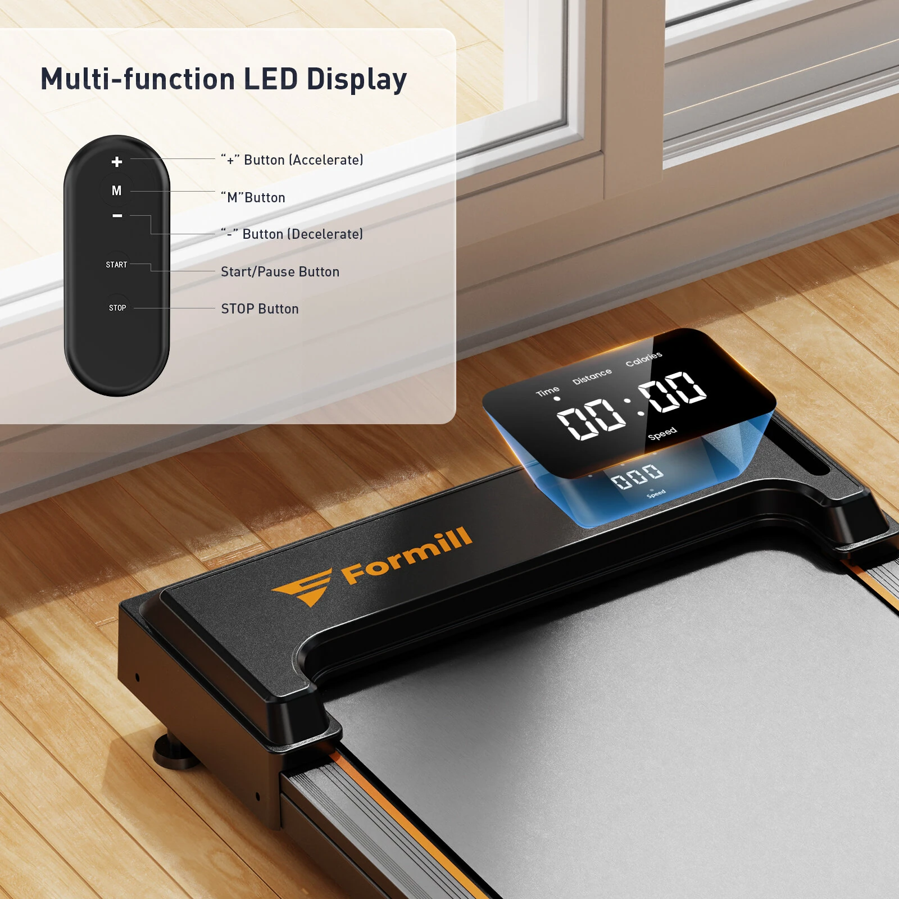

# Treadmill Remote Protocol

This repository documents the reverse‑engineered RF protocol used by the **Formill FT‑21 treadmill** remote control, and provides an Arduino library (`TreadmillRemote`) for transmitting commands via an ESP8266 RF module.



## 📖 Available Methods

Once you create a `TreadmillRemote` instance and call `begin()`, you can use the following methods to control the treadmill:
| Method	| Description
| --------- | -----------
| begin()	| Initializes the transmitter pin. Call this once in setup().
| start()	| Sends the START command to begin treadmill operation.
| stop()	| Sends the STOP command to halt the treadmill.
| plus()	| Sends the PLUS command to increase speed.
| minus()	| Sends the MINUS command to decrease speed.
| mode()	| Sends the MODE command to cycle through treadmill modes.

### Example 

```cpp
#include <TreadmillRemote.h>

TreadmillRemote treadmillRemote(D2);

void setup() {
    treadmillRemote.begin();

    treadmillRemote.start();   // Start treadmill
}

void loop() {
    // Nothing here
}

```

## 🎛 Treadmill Remote Button Frames

### 🔎 Prefix Note
All frames share the same **54‑bit prefix**:
`101010101010101010101010101010101010101010101010010101`


| Button | Full 81‑bit frame |
|--------|--------------|
| PLUS   | 101010101010101010101010101010101010101010101010010101010110100110101010100101100 
| MINUS  | 101010101010101010101010101010101010101010101010010101011010011010101010010110010
| STOP   | 101010101010101010101010101010101010101010101010010101100110101010101001100101010
| START  | 101010101010101010101010101010101010101010101010010101011010100110101010010101100
| MODE   | 101010101010101010101010101010101010101010101010010101100101010110101001101010100


## ⏱ Protocol Timings (Rounded)

| Element     | Length (µs)
|-------------|-----------
| **Short**   | 300
| **Long**    | 800
| **Sync**    | 10000

## 📂 RAW Captures

For reference, here are the raw pulse timings captured directly from the treadmill remote.  
Each line starts with the sync pulse (~10 ms), followed by alternating HIGH/LOW durations in microseconds.

### STOP
10024,822,297,814,298,813,303,810,305,809,306,807,302,808,310,803,305,806,306,809,310,800,314,801,310,800,316,796,315,799,312,798,320,793,319,794,325,792,320,789,320,796,320,792,323,790,326,787,322,289,825,295,819,293,815,796,320,295,818,797,318,793,319,793,319,795,323,789,324,786,329,289,824,789,320,294,821,292,814,302,811,302


### START
10003,842,281,827,290,820,296,818,296,813,300,812,302,812,303,811,301,808,309,804,306,802,315,801,316,798,313,797,315,799,312,800,316,798,316,797,318,793,317,795,321,792,322,791,320,794,322,788,323,292,821,292,821,294,814,299,815,797,316,799,315,797,315,297,816,798,316,796,317,797,316,797,321,292,813,297,815,302,816,794,321,292


### MINUS
10005,840,282,825,293,814,302,814,300,813,300,806,307,809,301,809,304,810,305,806,315,799,315,792,314,801,313,801,312,799,313,800,314,798,317,796,317,795,320,793,320,793,320,791,319,792,329,785,323,288,821,296,812,302,814,300,809,799,320,795,317,298,815,793,318,795,319,793,323,791,324,788,317,297,819,296,813,796,318,296,815,301

### PLUS
10006,838,282,825,295,815,295,819,298,814,300,807,307,811,301,809,306,806,307,806,307,805,315,797,312,803,312,798,314,799,316,795,317,797,315,798,321,787,328,789,323,785,328,788,324,789,324,788,326,287,823,292,814,302,814,298,813,298,814,801,314,797,317,296,813,800,317,798,315,794,324,788,323,790,320,292,819,296,814,800,316,296


### MODE
10003,840,284,823,299,815,297,814,301,807,304,810,303,808,308,806,306,806,311,800,311,803,314,796,316,797,312,798,318,797,317,796,315,796,317,796,323,788,323,789,321,793,323,789,326,786,329,783,327,287,821,293,818,299,816,791,320,295,817,297,812,302,811,303,810,799,317,798,316,794,316,301,809,799,317,799,317,796,317,794,320,296